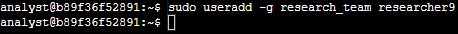
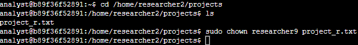
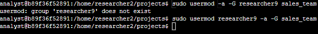

**Add and Manage users with Linux commands**

In this scenario, a new employee with the username researcher9 joins an organization. You have to add them to the system and continue to manage their access during their time with the organization.

**1- Add a new user.**

The organization needed to add in researcher9 to the system, in the “research_team” group. I used the “sudo” command in order to attain root user privileges, then I used the command “useradd” in order to add to the specified group and set it as their primary group by using the command “-g” which means to place the user under the group that is specified “research_team” in this case, followed by the user’s name “researcher9”. This will let Linux know that the user must be placed into that specified group. Because there were no errors after the command was entered, the task successful.

**2- Assigning file ownership.**

The organization needs researcher9 to take responsibility for “project_r.txt”, so my next task is to make researcher9 the owner of that file. The file is already owned by another user, so I will be using the “chown” command in order to change user ownership. First I head over to the directory that the file is located by using the command “cd home/researcher2/projects” in order to be at the right directory, than I list what’s in it with “ls” to see that I am indeed in the right directory. Indeed I was, so I move forward with changing the owner of one of the files in that directory by using the command “sudo chown” which allows me root user privileges, followed by “researcher9 project_r.txt” which tells Linux that “researcher9” is now the owner of “project_r.txt”. Run the command, no error came back, which tells me it was successful.

**3- Adding the user to a secondary group.**

The scenario now changes to the user being implemented into another role, now they are doing both sales and research. The organization asks for “researcher9” to be places into a secondary group, “sales_team”. This is done by using “sudo usermod reseracher9” in order to have root user access to change, “researcher9’s” group. Followed by “-a” which adds user to another group and “-G” to specify that this is not a change to the user’s primary group, the user is being added into a secondary group.

**4-Delete a user.**

The scenario now changes where the user is now leaving the company and we must remove them from the system. Using the “sudo” command once more to use root user privileges, I enter the command “userdel” followed by the user I am deleting, “researcher9” and run the command. No error came back; user is no longer in system. By running “cut -d: -fl /etc/passwd” I can see a list of users and researcher9 is no longer on that list.

