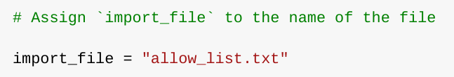
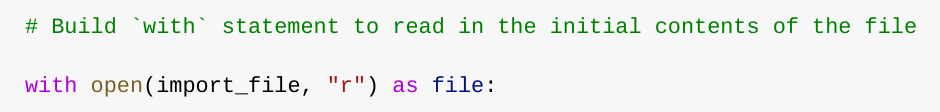
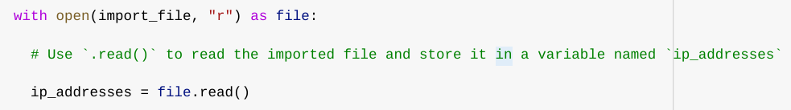
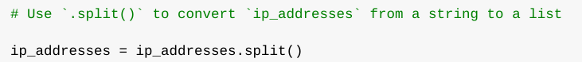
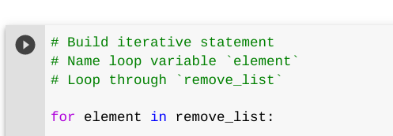
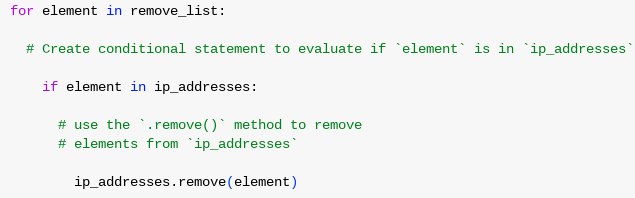
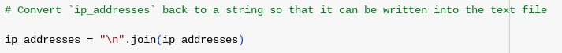
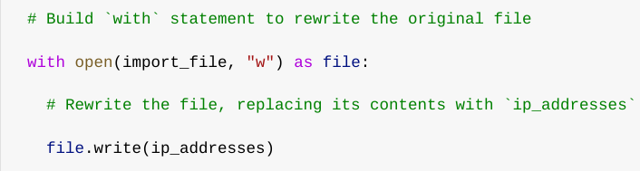

# Algorithm for file updates in Python

## Project description

In this project, we were given a list of IP addresses that are allowed to access sensitive content called *“allow_list.txt”*. We were then given a second list with IP addresses that no longer have access to their content. I created an algorithm that automates the process of updating the *“allow_list.txt”* file and remove IP addresses that no longer have access.

## Open the file that contains the allow list

First, I assigned this file as a string using the variable *import_file*:

## 

Then, I used a with statement to open the file:

The *with* statement is used with *open(import_file, “r”)* function in read mode in order for the algorithm access the contents inside that file. Both parameters inside the function open allows me to chose what file to open and what to do with it, in this case, I am requestion to open the “allow_list.txt” file. The code also uses *as* to assign a variable named *file,* which stores the output of the *.open()* function.

## Read the file contents

Then, I used the *.read()* method to convert it into the string:

Because of my previous step that included the *“r”* for reading, I can now call the .*read()* function that converts the *“allow_list.txt”* file into a string and it allows me to read it. I then applied the *.read()* method to the *file* variable that we identified in the *with* statement. Lastly, I assigned the string output of this method to the variable *ip_addresses.* This code reads the contents of the *“allow_list.txt”* file into a string format that allows me to later use the string to organize and extract data in my Python program.

## Convert the string into a list

In order to remove individual IP addresses from the *“allow_list.txt”,* it needed to be in a list format. I achieved this by using the *.split()* method in order to convert the string output I got from *ip_addresses* into a list so I can than apply a *for* loop on it:

I called upon the *.split()* by appending it to a string variable. I than stored the resulting list back into the variable *ip_addresses*.

## Iterate through the remove list

My algorithm’s key part is to iterate through the IP addresses that are elements of the *remove_list.* In order to do so, we incorporate a *for* loop in order to achieve this goal:

The *for* loop in Python repeats code for a specified sequence. The purpose of this *for* loop is to apply specific statements to all elements in a sequence. The *for* key word starts a *for* loop, followed by the chosen loop variable *element and the* key word in*.* The key word *in* indicates Python to iterate through the sequence of IP addresses that needed to be removed and to assign each value to the loop variable *element*.

## Remove IP addresses that are on the remove list

The following code in the algorithm is to remove the IP addresses from the *“allow_list.txt”* using the *remove_list* and the IP addresses that are to be removed from the file:

## 

I first created a conditional that looked to see if the variable *element* which is standing in for the *remove_list* would iterate through *ip_addresses* list, and if it found that matching address to the ones in the *remove_list*, it would remove it from that list. That is done by the last line stating that the list *ip_addresses* followed by the *.remove(element)* would do just that. Using the *.remove* function and adding the variable *element*, Python iterates through the list removing the not allowed IP addresses from it.

## Update the file with the revised list of IP addresses 

Since the necessary addresses were removed, we now needed to revert the list back into a string, in order to update it and close it properly. By that I used the *.join()* method:

The *.join()* method combines all items in an interable into a string. I used the *.join()* method to create a string from the list *ip_addresses* so that I could pass it in as an argument to the *.write()* method when re-writing the file *“allow_list.txt”*. While using the string “\n” as an indicator to separate each element on a new line.

Finally, I used another *with* statement and the *.write()* method in order to update the file:

By using a second argument of *“w”* with the *.open()* functions in my *with* statement, I was able to request the *“allowed_list.txt”* file to be update with its new list of allowed IP addresses, and to make sure necessary removed ones were gone. The *.write()* function writes string data to a specified file, and replaces its existing content with the newly edited one. In this care it’s telling to write in the *file*, the new *ip_addresses* list we just edited.

## Summary

Created an algorithm that pulls up a specific file, edits them, saves what’s been edited and it can easily be transformed into a function to be brought up again in order to repeat this task without re-writing the whole script.
