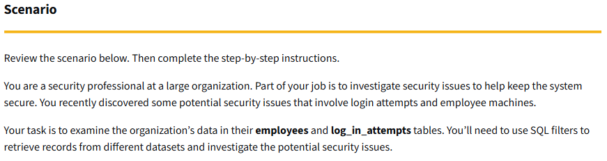
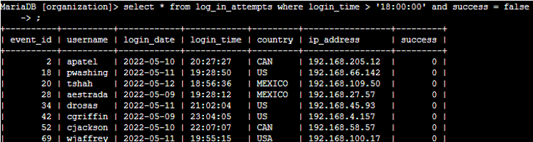
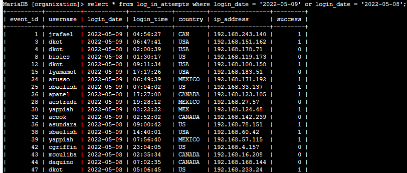
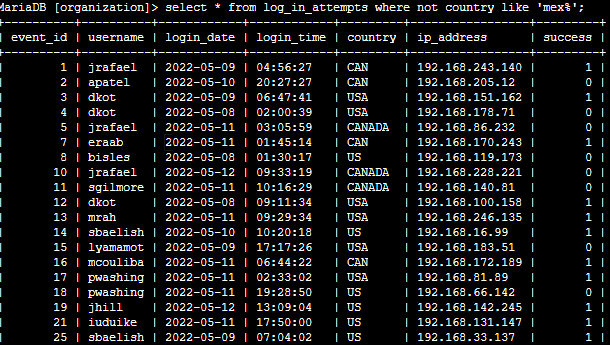
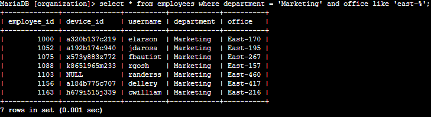
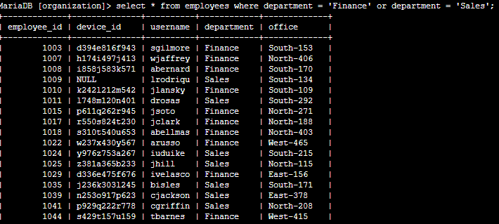
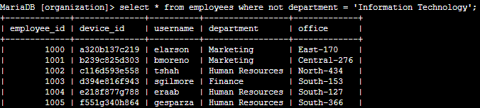

My first task was to retrieve after hours login attempts.

My next task was to retrieve login attempts on specific dates. The task states that “Your team is investigating a suspicious event that occurred on '2022-05-09'. You want to retrieve all login attempts that occurred on this day and the day before ('2022-05-08')” So I query:

75 hits came back.

So I proceeded towards the next task, to retrieve login attempts outside of Mexico for investigation purposes:

144 hits came back.

The next task was to retrieve employees in Marketing in order to obtain information on employes at East building for updating their machines:

My next task was to retrieve employees in Finance and Sales for updates:

My next task was to retrieve all employees not in IT, the IT computers have already been updated, so this is to rule them out to find those who hasn’t been.

161 hits came back.

Summary: This task was very relevant on how to use the filters LIKE, AND, OR, and NOT as searching queries in SQL.
