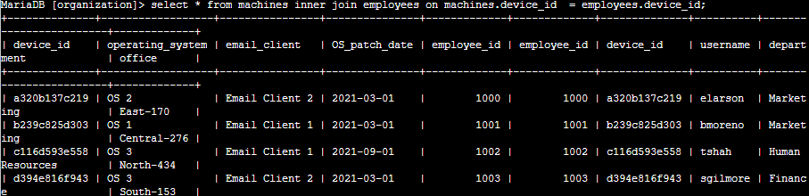
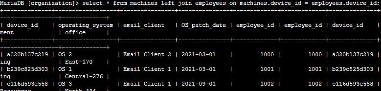
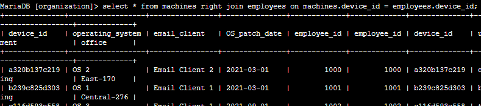
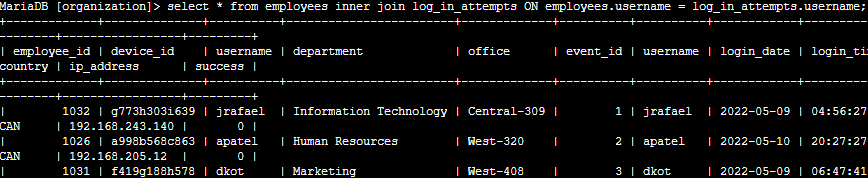

Complete a SQL join

**Scenario**

In this scenario, you’ll investigate a recent security incident that compromised some machines. You are responsible for getting the required information from the database for the investigation. Here’s how you’ll do this task: **First**, you’ll use an inner join to identify which employees are using which machines. **Second**, you’ll use left and right joins to find machines that do not belong to any specific user and users who do not have any specific machine assigned to them. **Finally**, you’ll use an inner join to list all login attempts made by all employees.

**Task 1. Match employees to their machines**

First, you must identify which employees are using which machines. The data is located in the machines and employees tables.

You must use a SQL inner join to return the records you need based on a connecting column. In the scenario, both tables include the device_id column, which you’ll use to perform the join.

**Task 2. Return more data**

You now must return the information on all machines and the employees who have machines. Next, you must do the reverse and retrieve the information of all employees and any machines that are assigned to them.

To achieve this, you’ll complete a left join and a right join on the employees and machines tables. The results will include all records from one or the other table. You must link these tables using the common device_id column.

-LEFT JOIN (Keep everything on the Left)

This tells SQL to keep every row from the **first** table, even if there is no match in the second.

- **The Goal:** See every single machine, even if it's sitting in a closet unassigned.

- **The Result:** If a machine has no user, the employee columns will simply say **NULL**.

> 

-RIGHT JOIN (Keep everything on the Right)

This tells SQL to keep every row from the **second** table, even if there is no match in the first.

- **The Goal:** See every single employee, even if they haven't been issued a laptop yet.

- **The Result:** If an employee has no machine, the machine columns will say **NULL**.

**Task 3. Retrieve login attempt data**

To continue investigating the security incident, you must retrieve the information on all employees who have made login attempts. To achieve this, you’ll perform an inner join on the employees and log_in_attempts tables, linking them on the common username column.

