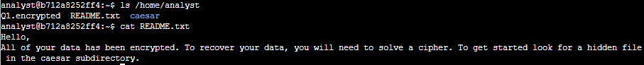
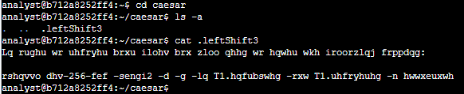
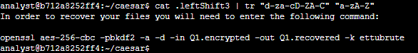
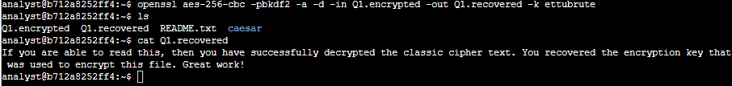

Decrypt an encrypted message

**Scenario**

In this scenario, all of the files in your home directory have been encrypted. You’ll need to use Linux commands to break the Caesar cipher and decrypt the files so that you can read the hidden messages they contain.

**Task 1. Read the contents of a file**

The lab starts in your home directory, /home/analyst, as the current working directory.

In this task, you need to explore the contents of your home directory and read the contents of a file to get further instructions.

**Task 2. Find a hidden file**

In this task, you need to find a hidden file in your home directory and decrypt the Caesar cipher it contains. This task will enable you to complete the next task.

Task 3.  Decrypt the Caesar cipher and Decrypt File

In this case, the command *tr "d-za-cD-ZA-C" "a-zA-Z"* translates all the lowercase and uppercase letters in the alphabet back to their original position. The first character set, indicated by *"d-za-cD-ZA-C"*, is translated to the second character set, which is *"a-zA-Z"*.

Now that you have solved the Caesar cipher, in this task you need to use the command revealed in .leftshift3 to decrypt a file and recover your data so you can read the message it contains.

In this instance, the openssl command reverses the encryption of the file with a secure symmetric cipher, as indicated by AES-256-CBC. The *-pbkdf2* option is used to add extra security to the key, and *-a* indicates the desired encoding for the output. The *-d* indicates decrypting, while *-in* specifies the input file and *-out* specifies the output file. The *-k* specifies the password, which in this example is *ettubrute*.
