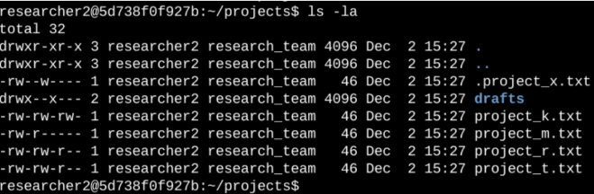
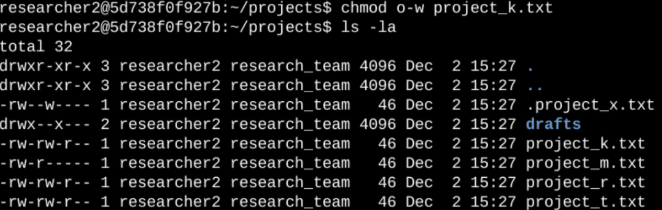
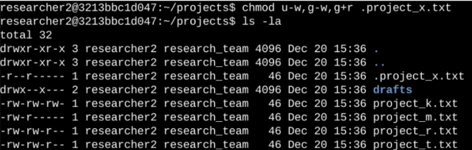
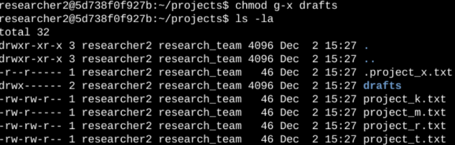

**Setting file permissions in Linux**

**Description**

The research team needs to update the file and directory permissions within its “projects” directory. The permissions do not reflect the requested authorization that should be given by my organization. By checking, updating and defining who has access to what, will keep the system and organization secure. In order to complete this task, I performed the next few tasks as follows.

**1-Checking details on permissions.**

The following screenshot demonstrates the beginning of this task, where permissions were set as when I began.

Under the correct directory, I asked bash to list me all files in the “project” directory with the “ls” command, and also requested it to show me the hidden files with the “-la” command. The code returned a detailed list the directory’s content, including hidden files. The output showed a hidden file called “.project_x.txt”, a directory named “drafts” and 5 other project files.\
\
**2-Describing the permission string.**

The 10-character string on the beginning of every line in the code’s output indicates who has authorizations over the files. The 1st character indicates if we are talking about a directory, represented by “d”, or a file, represented by “-“. The 2nd-10th characters are represented by “r” (for reading permission) “w” (for writing permission) “x” (for executing permission) or “-“ (no permission granted), these indicate what level of permission a user, group or others have. Breaking them down even further, the 2nd-4th characters will indicate a user’s permission, the 5th-7th characters will indicate the group’s permission, and the 8th-10th characters will indicate other’s permissions to either read, write or execute that file.\
\
As an example, look at line 5 of the bash code. The first 10 characters represent what I just mentioned, so to break it down, this is a file, represented by that very 1st character being a “-“, and the user has reading and writing permissions, but no permission to execute, represented by the 2nd-4th characters “r w -“, same goes for the group’s permission represented by the 5th and 7th character’s also being “r w -“, and other’s only have permission to read it, indicated by the 8th-10th characters being “r - -“. No one has the power to execute that file, hence the lack of an “x” on the 4th, 7th and 10th characters.

**3- Change file permissions**

The organization has requested that “others” shouldn’t have authorization to “write” in any of their files. The following screenshot shows how I used Linux commands in order to remove the writing permission, from “others” under the “project_k.txt” file.

Using the command “chmod” I can change the permission of “o” that represents “other’s”, with the following command “-w” in the file “project_k.txt”, “chmod o-w project_k.txt” is basically saying that other’s (“o”) cannot write “-w” the file “project_k.txt” anymore, by running “ls -la” again, I can confirm that the right permissions have been set as the organization requires it.

**4- Change file permissions on a hidden file**

The organization also requested that they do not want anyone to have write access to the hidden file “.project_x.txt”, but the user and group should be able to have reading access to it. The following screenshot shows how I used Linux commands to achieve this task.

The first line displays the command I entered to achieve this, using “chmod” again to change permissions, “u-w,g-w,g+r .project_x.txt” indicates that user “u” and group “g” lost writing “-w” privileges, while group “g” also acquired reading “+r” privileges. There should be any spaces in between setting the permissions in between multiple users, groups, and others, or it may cause an error, making the terminal interpreted as files names instead of part of the permission command. I than use the command “la -ls” in order to double check that the permissions are set properly.

**5- Changing directory permissions**

The organization also requires that only “researcher2” user has access to the “drafts” directory and its content. This means that only “researcher2” should be allows to have execute, or “x” permissions. The following screenshot demonstrated how I used Linux commands to achieve this task.

Lines 1 of the output represents currently directory “.” And line 2 represents the parent directory “..”. Line 4 is what we are after, changing the permissions in the “drafts” directory. Using “chmod” once more to change permissions, I input “g-x drafts” which tells group “g” that they no longer have executable permissions on that directory “-x drafts”. Since “researcher2” had access already to executing permissions, it looks like ”drwx------" now, so we didn’t have to change that.

**6- Summary**

I followed the requested instruction from the organization to set permissions properly in the “projects” directory. The very first thing I had to do was find the proper directory and using the commands “la -ls” in order to view current set permissions which dictated how I was going to go about the task.
